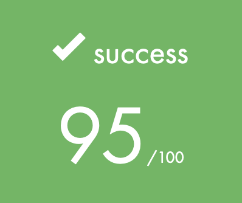
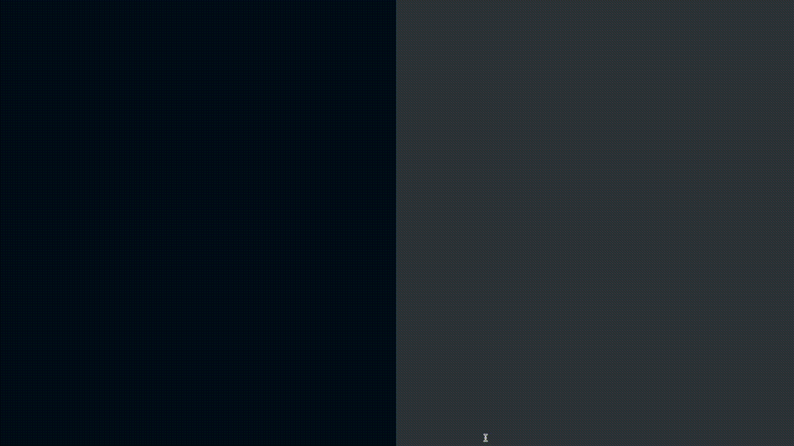

# MINISHELL: As beautiful as a shell

## Project Goal
We're going to really start and understand the terminal here, because we're going to be writing our own shell! The existence of shells is linked to the very existence of IT.
At the time, all developers agreed that communicating with a computer using aligned 1/0 switches was seriously irritating. It was only logical that they came up with the idea of creating a software to communicate with a computer using interactive lines of commands in a language somewhat close to the human language. Thanks to Minishell, you’ll be able to travel through time and come back to problems people faced when Windows didn’t exist.

## Install & Run
Make sure you have the readline library installed. Then simply run `make` and launch `./minishell`.

## Key Learnings
1. Shell History
2. Redirections
3. Paths, environments and variables
4. Heredocs
5. Pipes
6. Variable expansion
7. Signals
8. Builtin functions
